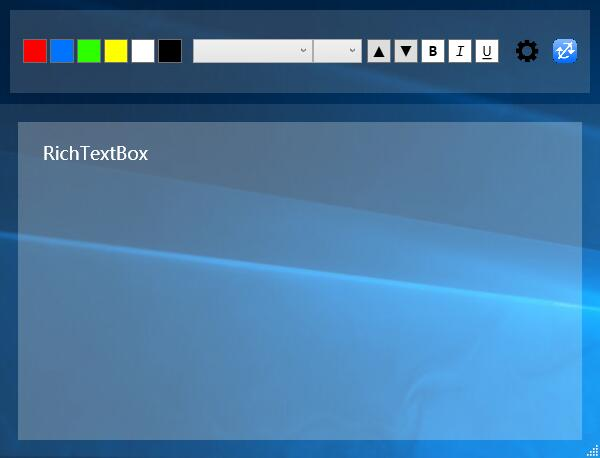
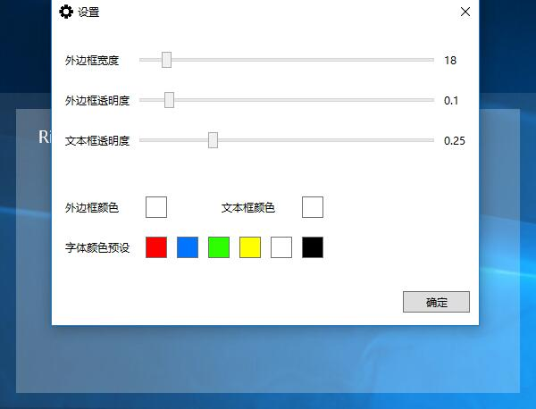
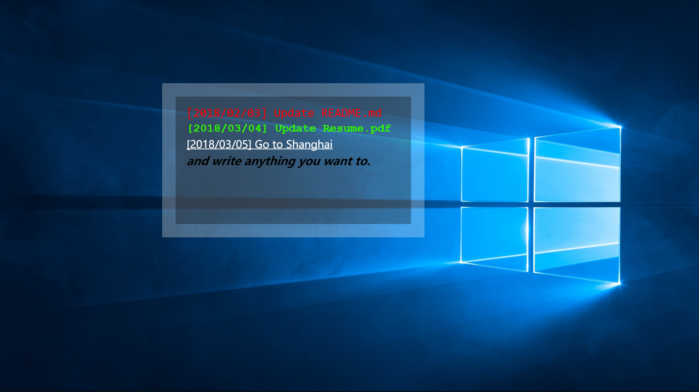

# whitodo-csharp

## Overview

WhiToDo, the to-do list panel for working management. 

[Click to Download](https://github.com/Gnekiah/whitodo-csharp/releases)

## Usage

- Double click `whitodo.exe` and the main window shown.

- Click `settings` button to do set.

- Write todo item and click `whitodo logo` to attach into desktop. Before attaching you can move the window to anywhere.

